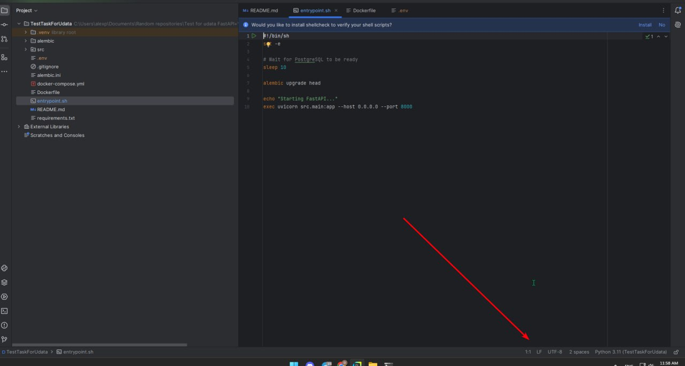

# TestForUdata

This is an implementation of a service on FastAPI with WebSocket support.

## 📥 Clone the Repository

```bash
git clone https://github.com/Kagaru1212/TestTaskForUdata.git
```

## ⚙️ Environment Configuration

### 1. `.env` ***(Create such a file on your computer and copy the following into it)***

```
POSTGRES_USER=auction_user
POSTGRES_PASSWORD=auction_pass
POSTGRES_DB=auction_db
POSTGRES_HOST=db
POSTGRES_PORT=5432
```

## To begin with, activate the virtual environment, for example, in this way.

**`File -> Settings -> Project -> Python Interpreter -> Add Interpreter -> Add Local Interpreter`** 

## 🛠 Using Docker

### 🚀 1. Build and Start All Containers

```bash
docker-compose build --no-cache  
```

```bash
docker-compose up
```

# Attention

## If you are unable to launch the project due to an error

```
exec ./entrypoint.sh: no such file or directory
```

## Then you need to open the file *`entrypoint.sh`* and change its line ending format to LF!

- Right here

